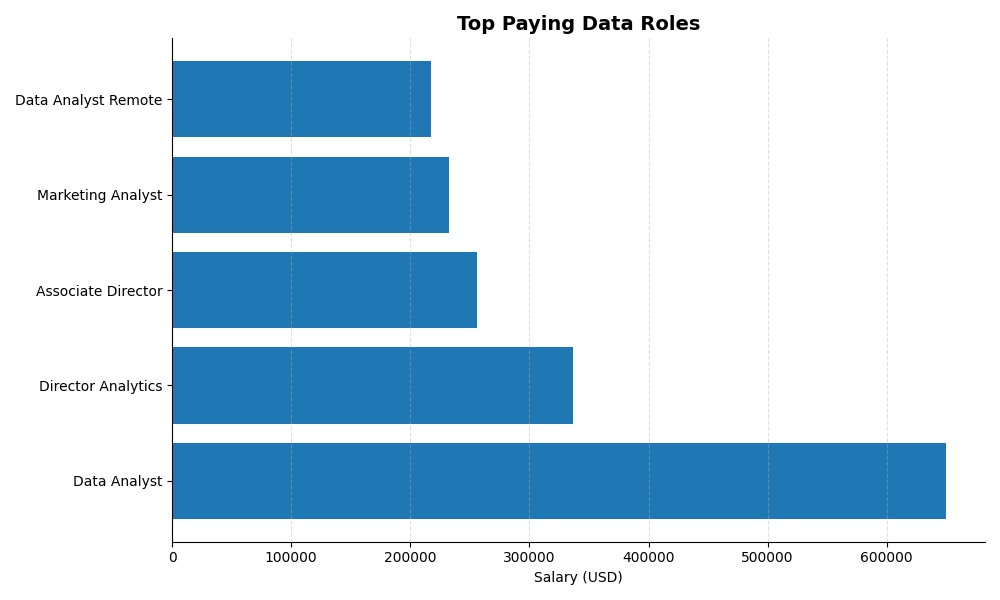
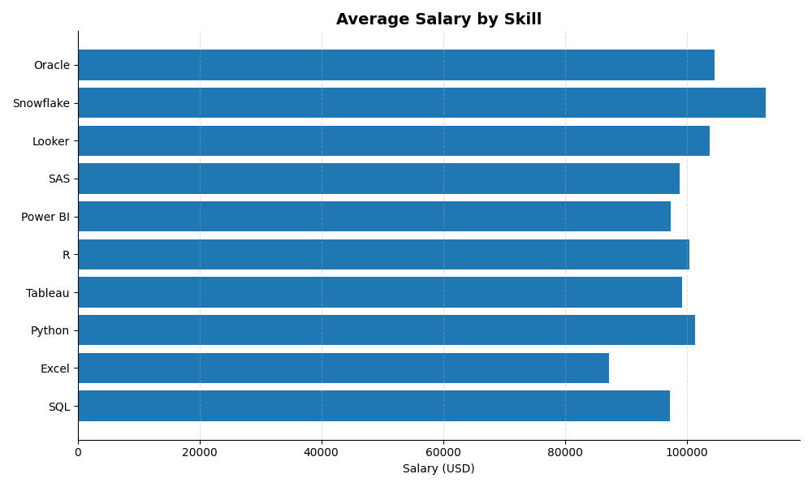
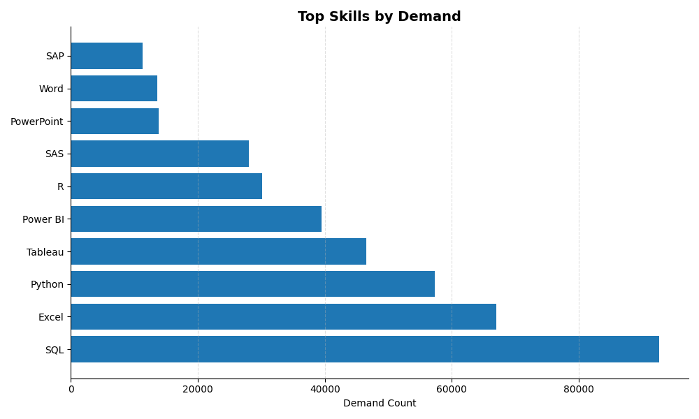

# SQL Project: Data Job Analysis 2026

## Overview
This project explores the data job market using SQL, focusing on demand, salaries, and required skills. By analyzing real-world job postings, the project uncovers patterns in how the role of a data analyst is evolving and what skills are most valuable in today’s market. Check SQL queries here: [Project_sql](/Project_sql/)

---

## Tools Used
- **SQL** – used for querying, filtering, and aggregating data to extract insights from the dataset  
- **PostgreSQL** – served as the main database for storing and managing structured job market data  
- **VS Code** – used as the primary development environment for writing and organizing SQL queries  
- **Excel** – applied for quick data inspection, validation, and initial exploration  
- **Git & GitHub** – used for version control, project tracking, and showcasing the project portfolio  

---
## Key Analyses
Each query in this project was designed to uncover meaningful patterns in the Data Analyst job market, focusing on salary distribution, skill demand, and the relationship between tools and compensation. Below is a breakdown of the key questions explored and the insights derived from them:

### 1. 📊 Top Paying Data Analyst Jobs
This analysis highlights the highest-paying roles within the dataset.  
The results show that salaries vary dramatically even within the same job title, with positions labeled as Data Analyst reaching executive-level compensation.

```sql
  SELECT
        job_id,
        Job_title,
        job_location,
        job_schedule_type,
        salary_year_avg,
        job_posted_date,
        name as company_name
    FROM
        job_postings_fact
    LEFT JOIN company_dim on job_postings_fact.company_id = company_dim.company_id
    WHERE
        job_title_short = 'Data Analyst'  
        AND job_location = 'Anywhere' AND  
        salary_year_avg IS NOT NULL
    ORDER BY
        salary_year_avg DESC
    LIMIT 50;
```
👉 A clear pattern emerges:  
- Seniority (Lead, Principal, Director) significantly increases salary  
- Business-focused roles (Product, Marketing, Growth) tend to offer higher compensation  
- Remote positions dominate the top tier, indicating a globalized job market  

---

### 2. 💰 Top Paying Job Skills for Data Analyst
This section explores which skills are associated with the highest salaries for Data Analyst.  
The data shows that advanced and infrastructure-related tools command a premium.

```sql
WITH top_paying_jobs AS (
    SELECT
        job_id,
        Job_title,
        salary_year_avg,
        name as company_name
    FROM
        job_postings_fact
    LEFT JOIN company_dim on job_postings_fact.company_id = company_dim.company_id
    WHERE
        job_title_short = 'Data Analyst'  
        AND job_location = 'Anywhere' AND  
        salary_year_avg IS NOT NULL
    ORDER BY
        salary_year_avg DESC
    LIMIT 5
    )
SELECT
    top_paying_jobs.*,
    skills
FROM 
    top_paying_jobs
INNER JOIN skills_job_dim on top_paying_jobs.job_id = skills_job_dim.job_id
INNER JOIN skills_dim on skills_job_dim.skill_id = skills_dim.skill_id
ORDER BY
    salary_year_avg DESC;
 ```
👉 Key observations:
- Cloud technologies (AWS, Azure) and data platforms (Snowflake) lead in salary  
- Specialized tools like Looker and Oracle also provide strong earning potential  
- Core skills (SQL, Python) remain valuable but are less differentiating at higher salary levels

---

### 3. 📈 Top Demanded Skills
This analysis focuses on the most frequently requested skills in job postings.  
It reflects the baseline expectations for entering and growing in the data field.

```sql
 SELECT 
    skills,
    COUNT(skills_job_dim.job_id) as demand_count
FROM job_postings_fact
INNER JOIN skills_job_dim on job_postings_fact.job_id = skills_job_dim.job_id
INNER JOIN skills_dim on skills_job_dim.skill_id = skills_dim.skill_id
WHERE
    job_title_short = 'Data Analyst' 
GROUP BY
    skills
ORDER BY
    demand_count DESC
LIMIT 10
```
👉 Key insights:
- SQL and Excel dominate the market, forming the foundation of most roles  
- Python and BI tools (Tableau, Power BI) are essential for modern analysts  
- Traditional tools (PowerPoint, Word) highlight the importance of communication  

---

### 4. 🧠 Top Paying Skills

By combining salary and demand data, we can identify which skills provide the greatest financial return.

| Skill       | Average Salary ($) |
|------------|-------------------|
| 🥇 PySpark    | 208,172           |
| 🥈 Bitbucket  | 189,155           |
| 🥉 Couchbase  | 160,515           |
| Watson     | 160,515           |
| DataRobot  | 155,486           |
```sql
SELECT
       skills,
       ROUND (AVG(salary_year_avg), 0) AS avg_salary
   
    FROM
        job_postings_fact
    INNER JOIN skills_job_dim on job_postings_fact.job_id = skills_job_dim.job_id
    INNER JOIN skills_dim on skills_job_dim.skill_id = skills_dim.skill_id
    WHERE
        job_title_short = 'Data Analyst'  
        AND job_work_from_home = TRUE 
        AND salary_year_avg IS NOT NULL
    GROUP BY
        skills
    ORDER BY
        avg_salary DESC
    LIMIT 25
```
Findings:
- High-paying skills are often linked to big data and cloud ecosystems  
- Tools like Snowflake, Hadoop, and cloud platforms significantly increase earning potential  
- Less common but specialized skills tend to outperform widely used tools in salary  

> 👉 This suggests that rarity and complexity drive compensation more than popularity alone.

---

### 5. 🚀 Optimal Skills

The optimal skill set is not about mastering a single tool, but combining complementary capabilities.

| Skill        | Demand Count | Average Salary ($) |
|-------------|-------------|-------------------|
| SQL         | 398         | 97,237            |
| Excel       | 256         | 87,288            |
| Python      | 236         | 101,397           |
| Tableau     | 230         | 99,288            |
| R           | 148         | 100,499           |
| Power BI    | 110         | 97,431            |
| SAS         | 63          | 98,902            |
| PowerPoint  | 58          | 88,701            |
| Looker      | 49          | 103,795           |
```sql
WITH skills_demand AS (
    SELECT 
        skills_dim.skill_id,
        skills_dim.skills,
        COUNT(skills_job_dim.job_id) as demand_count
    FROM job_postings_fact
    INNER JOIN skills_job_dim on job_postings_fact.job_id = skills_job_dim.job_id
    INNER JOIN skills_dim on skills_job_dim.skill_id = skills_dim.skill_id
    WHERE
        job_title_short = 'Data Analyst' 
        AND salary_year_avg IS NOT NULL
        AND job_work_from_home = TRUE
    GROUP BY
        skills_dim.skill_id),
        average_salary AS (
   SELECT
        skills_job_dim.skill_id,
       ROUND(AVG(job_postings_fact.salary_year_avg), 0) AS avg_salary
   
    FROM
        job_postings_fact
    INNER JOIN skills_job_dim on job_postings_fact.job_id = skills_job_dim.job_id
    INNER JOIN skills_dim on skills_job_dim.skill_id = skills_dim.skill_id
    WHERE
        job_title_short = 'Data Analyst'  
        AND job_work_from_home = TRUE 
        AND salary_year_avg IS NOT NULL
    GROUP BY
        skills_job_dim.skill_id
)

SELECT 
    skills_demand.skill_id,
    skills_demand.skills,
    demand_count,
    avg_salary
FROM 
    skills_demand
INNER JOIN average_salary on skills_demand.skill_id = average_salary.skill_id
WHERE 
    demand_count > 10
ORDER BY 
    demand_count DESC,
    avg_salary DESC
LIMIT 100;
```

The most effective combination includes:
- **Core skills:** SQL, Excel  
- **Analytical tools:** Python, R  
- **Visualization:** Tableau, Power BI  
- **Advanced stack:** AWS, Azure, Big Data tools  

>👉 The strongest candidates are those who bridge data extraction, analysis, visualization, and real business impact.

---
## Results

- **SQL and Excel dominate the market**, forming the foundation for most data roles  
- **Python and BI tools (Tableau, Power BI)** are essential for higher-value positions  
- **Cloud and Big Data technologies (AWS, Azure, Snowflake)** are linked to higher salaries  
- The title *“Data Analyst”* varies significantly in meaning and salary, ranging from mid-level roles to high-level positions  
- Senior roles such as *Lead, Principal, and Director* show a clear increase in compensation  
- Remote work has enabled access to high-paying opportunities globally  

---

## Conclusions

This project demonstrates that the modern data analyst role is no longer limited to basic data querying and reporting. Instead, it is becoming a central function in how companies operate, make decisions, and compete in the market.

The analysis reveals several key realities of the data job market:

- **Foundations still matter** – SQL and Excel remain essential entry points into the field. Despite the rapid growth of new technologies, most workflows still rely on structured data and fundamental tools for querying, cleaning, and initial analysis.  

- **Differentiation comes from advanced tools** – Python, BI tools, and cloud technologies significantly increase a candidate’s value. These tools enable automation, deeper analysis, and scalable solutions, allowing analysts to move beyond simple reporting into more complex problem-solving.  

- **The highest salaries are tied to impact** – roles that influence business decisions, product growth, or strategy are compensated the most. The data shows that companies reward not just technical ability, but the capacity to translate data into actionable insights that drive measurable outcomes.  

- **The role is no longer purely technical** – strong communication and data visualization skills are just as important as technical expertise. Analysts are expected to present insights clearly and align their work with business objectives.  

- **The market is becoming more global and competitive** – the prevalence of remote roles indicates that opportunities are no longer location-bound, increasing both accessibility and competition for high-paying positions.  

Ultimately, the data analyst role is evolving into a hybrid position that requires a balance of technical expertise, analytical thinking, and business awareness. Success in this field depends not only on mastering tools, but on understanding how data connects to real-world decisions.

> 👉 The real competitive advantage is not in knowing more tools, but in using data to drive decisions that create measurable business value.